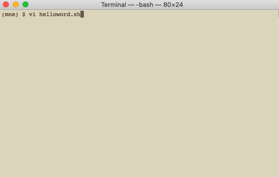
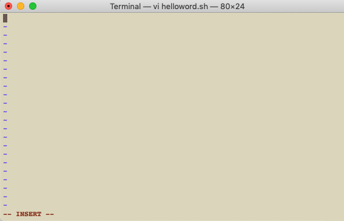
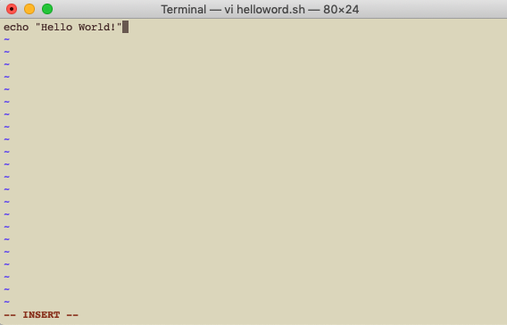
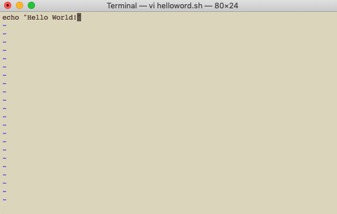
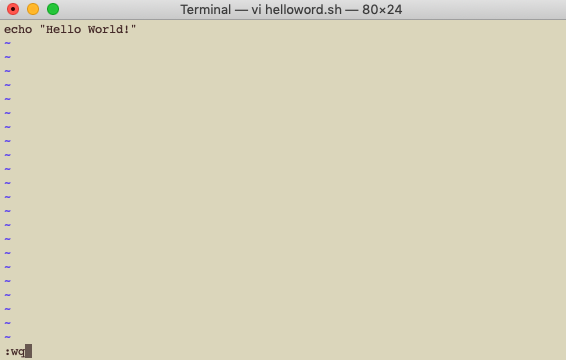

# 2. Creating simple bash scripts

## 2.1. The vi editor

There are an unlimited number of editors available for writing shell scripts in Linux and Mac. A few are installed by default; some are used through the terminal and some others use a graphical interface (GUI). They all have pros and cons and the decision to use one or another is totally personal. In this section I will explain how to use the editor vi, which is installed by default in both Linux and MacOS and can be accessed and used through the terminal window.

These are some of the advantages of vi:

- It is available in all Unix systems and any type of terminal.
- It doesn't require a lot of memory to run. So, if you are running many heavy programs in your computer, vi is a good option because it won't slow down the machine anymore and will still load very fast.
- Even though there are a lot of commands that you must learn to become skilled in using this program, once you learn them you can use very short and fast commands to accomplish a lot of things. For example, you can delete all the characters from your current cursor location to the end of the line, just by pressing two times the d in your keyboard (while in command mode). Below you will find a chart with the most commonly used shortcuts in vi.
- You can use it to code in different languages (i.e. it also works for Python, HTML, etc.).
- Some editors add special characters to the text and when you run scripts written in those editors, they could fail. vi doesn't add any special characters, and if it did, they are visible in the editor.
- If you don't like using your mouse too much, or you don't have a mouse, or your mouse doesn't work properly, then vi editor is a good choice because you rarely need to use the mouse. Most things are accomplished using the keyboard.

However, there are some disadvantages too:

- The learning curve can be steep, especially for people who are new to programming and not very comfortable with computers. If you're new to bash, you not only need to learn the language, but also a whole set of commands specific to this program.
- Not being able to use your mouse can end up wasting your time while you learn all the commands that are used to scroll around the file or jump from one line to another.
- It doesn't give you any error messages or explanation of why it's not doing what you want. If you type the wrong command, it will just do nothing (or do the wrong thing).

Generally, many people with relatively good experience programming love this editor. In my opinion, it's a good tool to use once you are familiar with shell and have been programming for a while. However, it might be a great option for you if you like challenges or if you are already somehow familiar with shell.

To create a new file, type (on the command line) `vi file_path/file_name`. For example, if you want to create a file called test.sh in the desktop, you should type `vi ~/Desktop/test.sh`. The vi editor will open in the current terminal.

This program runs in two modes, the command mode and the typing mode. By default, it opens in command mode. What this means is that anything you type is not actually being registered in the file but are commands. For example, if you type :q! as soon as you open the file, it will quit without saving (because :q! is the command for ignoring any modifications and exiting). If you type :w it will save changes to the file (or if you haven't write anything, it will just create an empty file). To change to typing mode, type a (a is the command for entering typing mode). After you type a (in lower case), you can start editing your file. To go back to command mode (for example to save changes), press the key esc (top left corner of the keyboard).

Using the vi editor for the first time Open the vi editor, create a script that prints "Hello Word", and save it with the file name helloword.sh

### Step 1

Open the vi editor



### Step 2

Type a to start editing the file. You will see that an **--Insert--** message in the bottom of the terminal appears. This means that now you are in typing mode.



### Step3

Start typing commands. The simplest command, to print a message such as "Hello World" (or any other) is echo. The syntax of this command is the word ```echo``` followed by the message you want to print out between quotation marks (in this case "Hello World!").



### Step4

Once you finish your script, press the esc key to enter command mode. You will see that the **--Insert--** message at the bottom of the terminal disappears (this means that now you are in command mode).



### Step5

Save changes and exit the vi editor. In order to do this, type ```:wq``` (to write (w) and quit (q) at the same time). The table below will show you the most commonly used commands for vi.



The following table shows a **list of vi commands** that can be used in command mode and the action that will happen in each case. In general, a number preceding any vi command will tell vi to repeat the command that number of times. For example, ```p``` is the command for pasting. If you write (in command mode) ```2p```, then vi will paste whatever you copied two times where the cursor is currently located.

| Key/command | Action |
| ----------- | ------- |
| [ESC] | Switch to command mode |  
| [ctrl] `b` | Scroll backward one screen |  
| [ctrl] `d` | Scroll down half screen |
| [ctrl] `f` | Scroll forward one screen |
| [ctrl] `f` | Scroll forward one screen |
| [ctrl] `u` | Scroll up half screen |
| `.` | Repeat last command |
| `$` | Go to end of line |
| `? string` | Search backward for `string` |
| `/ string` | Search forward for `string` |
| `:0` | Go to beginning of line |
| `:N` | Go to line `N` |
| `:N,Md` | Delete lines `N` to `M` |
| `:N,MmP` | Move lines `N` to `M` and paste them after line `P` |
| `:N,MmP` | Copy lines `N` to `M` and paste them after line `P` |
| `:N,Mw file` | Save lines `N` to `M` to `file` |
| `:q` | Quit (does not save any changes) |
| `:q!` | Ignore any modifications made and quit. Searches and replaces the string old by the string new in the entire file. |
| `:%s/old/new/option` | The following letters can be added in the field option: `c` to prompt for confirmation, `g` to replace all the occurrences of the string, Searches and replaces the string old by the string new in the line in which the cursor is located |
| `:s/old/new/option` | The following letters can be added in the field option: `c` to prompt for confirmation, `g` to replace all the occurrences of the string |
| `:set ignorecase` | Ignore case sensitivity during search |
| `:set noignorecase` | Restore case sensitivity during search |
| `:set number` | Turn on line numbering |
| `:set nonumber` | Turn off line numbering |
| `:syntax on` | Turn on syntax colors in the text |
| `:syntax off` | Turn off syntax colors in the text |
| `:w` | Save changes |
| `:w file` | Save changes to `file` |
| `:wq` | Save changes and quit |
| `:x` | Save changes and quit |
| `a` | Switch to editing mode and continue writing where the cursor is located |
| `A` | Switch to editing mode and continue writing at the end of the line where the cursor is located |
| `i` | Switch to editing mode and continue writing where the cursor is located |
| `I` | Switch to editing mode and continue writing at the beginning of the line where the cursor is located |
| `cw` | Delete the rest of the word in which the cursor is located (keeps the characters located before the cursor) |
| `D` | Delete the rest of the line in which the cursor is located (keeps the characters and words located before the cursor) |
| `dd` | Delete the entire line where the cursor is located |
| `dw` | Delete the whole word in which the cursor is located |
| `J` | Put the next line at the end of the line where the cursor is located |
| `o` | Open line below cursor |
| `O` | Open line above cursor |
| `p` | Paste below current line |
| `P` | Paste above current line |
| `:u` | Undo previous command |
| `:U` | Undo all changes to line |
| `x` | Delete text at cursor |
| `X` | Delete (backspace) text at cursor |
| `yy` | Copy line in which the cursor is located |

## 2.2. Other editors

As I previously mentioned, there is an unlimited number of editors and the choice of which to use is totally personal. The following editors are available for both Linux and MacOS: [vim](https://www.vim.org/), [emacs](https://www.gnu.org/software/emacs/), [gedit](https://help.gnome.org/users/gedit/stable/) (which is also installed by default in Linux and uses a GUI, great for beginners), and [Eclipse](https://eclipseide.org/) (among many others). Eclipse is a lot more than an editor; it is a development environment used for programming in many other languages and for software development and modeling. The following are editors available only for MacOS: [Xcode](https://developer.apple.com/xcode/), [TextMate](https://macromates.com/), among many others.

## 2.3. Tips for writing scripts

1. Albeit not mandatory, the first line of any bash script should be the shebang (`#!/bin/bash`). This line indicates that the script is written in bash (instead of tcsh, for example) and that the bash interpreter should execute it.
2. Be organized when writing scripts. As you start writing longer and more complicated programs, this will become more important. Try to comment as often as possible so that other people can understand what your script is doing, which parameters are needed and what they mean or to understand the output. Commenting will also help you fix errors or keep track of the version, changes, authorship, etc, or to remember what your script does if you don't use it for a while. To insert a comment, you simply start the line with a hash (`#`). Any line that starts with this symbol will not be executed (except for the shebang). Also try to use indentation to know where pieces of code start and end (for example when doing loops). If you don't indent, understanding your own code will be very difficult. Part of being organized is also using appropriate variable names. Use names that are associated to the structure you're using (for example, if you're creating an array, naming it array will help you remember that this variable is an array and not a string or a number) and try to use short names (for example, instead of naming a variable myListOfSubjects, you can call it subjList).
3. It is also a good idea to use the following commands at the beginning of any script:
    - `set -e`: this will make the program exit as soon as it encounters an error. If you don't use this, then even if there's an error your code will continue to execute.
    - `set -u`: this will make the program exit when using undeclared variables. It will prevent the program from executing the wrong commands if you misspell a variable name.
4. Use double quotes (`"`) when declaring a string, single quotes (`'`) when declaring a character, and no quotes when declaring numbers. This will prevent word splitting (when declaring a string that has spaces) and other errors in your code.
5. Use functions. This topic will be covered in [chapter 11](content11.html). Using functions will make your code more readable, reusable, and will allow you to run only parts of the code without having to comment all the lines. This is especially useful when debugging or re-running a script.
6. If you are declaring a variable that the value should never change, then use the word `readonly` before the variable name. For example, if I want to declare a variable called age with value 30 and this value should never be replaced, then you should declare `readonly age=30` instead of `age=30`. If at some point in the script you try to replace the value of that variable, you will get an error message: `-bash: age: readonly variable`.

## 2.4. Running a script

Running a shell script is easy. You only type the path and name of the file in the command line and then press enter. For example, if your script is located in the Desktop and is called helloWord.sh, then to execute it you should type `~/Desktop/helloWord.sh` in the command line. If you get a Permission Denied error, this means that you must change its permissions to make it runnable. The topic of permissions is a bit complicated and will be explained in detail in chapter 8. But for now, you only need to know that the following command will allow you to execute the script if it's not runnable: `chmod 775 <script_path_and_name>`.
